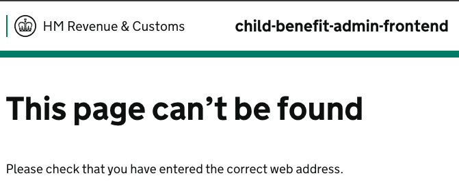
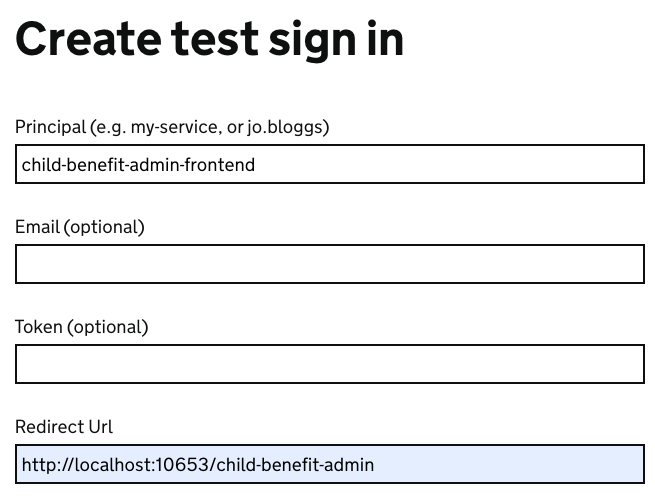

# child-benefit-admin-frontend

## OVERVIEW AND RESPONSIBILITY
The child-benefit-admin-frontend service provides monitoring for Child Benefit supplementary data being sent on to SDES for up to 30 days.

It does this by monitoring data in the [child-benefit-service](https://github.com/hmrc/child-benefit-service)'s child-benefits-supplementary-data mongo collection to read the status of files being processed by SDES. Any file can be retried which will send a new upload request for a file that is already being held in temporary object storage.

## ADMIN SERVICE INSTANCES
There exists an instance of the admin service in each environment (pre-production and production). This can be access using LDAP credentials.

| Environment | Link to Service                                               |
|-------------|---------------------------------------------------------------|
| QA          | https://admin.qa.tax.service.gov.uk/child-benefit-admin/      |
| Staging     | https://admin.staging.tax.service.gov.uk/child-benefit-admin/ |
| Production  | https://admin.tax.service.gov.uk/child-benefit-admin          |

## HOW TO RUN THE SERVICE
To start the service locally, make use of Service Manager. The Service itself can be run using the CHILD_BENEFIT_ADMIN_FRONTEND profile.

```> sm2 --start CHILD_BENEFIT_ADMIN_FRONTEND```

This service will also require INTERNAL_AUTH_FRONTEND to be run to access and use.

```> sm2 --start INTERNAL_AUTH_FRONTEND```

### AUTHENTICATING WHEN RUNNING LOCALLY
Whe logging in, the service will redirect to Internal Auth to login, this however presumes that Active Directory will be available which is not the case locally.
When the redirect is attempted this will result on a Not Found result on the url `http://localhost:10653/internal-auth-frontend/sign-in?continue_url=%2Fchild-benefit-admin`

To overcome this, instead ensure that the INTERNAL_AUTH_FRONTEND service is running (including in the CHILD_BENEFIT_SERVICE_ALL service manager profile) and navigate to `http://localhost:8471/test-only/sign-in`.

Insert any value for **Principal** and set the Redirect Url to `http://localhost:10653/child-benefit-admin` and select *Sign In*. This will set the necessary authentication cookies and return your locally running instance of this service.


## HOW TO TEST
The service itself has a suite of unit tests as a part of the repository. These are located under _./child_benefit_admin_frontend/test_ can be run directly in your IDE or with a unit test running tool of your choice.

## TEAM CHANNEL AND WHO OWNS THE SERVICE
Owning Team: SCA Optimization

Slack Channel: #team-sca-child-benefit

### License
This code is open source software licensed under the [Apache 2.0 License]("http://www.apache.org/licenses/LICENSE-2.0.html").